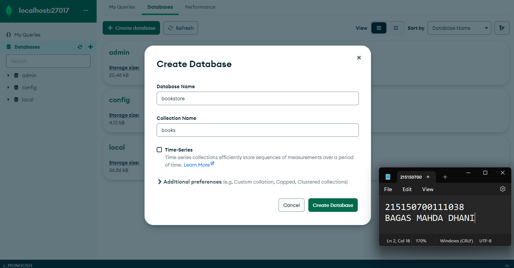

Nama    : Bagas Mahda Dhani  
NIM     : 215150700111038  
Matkul  : Pemin-A

# CRUD MONGODB

## Dasar Teori
### MongoDB Compass
MongoDB Compass adalah tool berbasis Graphical User Interface (GUI) yang digunakan untuk berinteraksi dengan MongoDB yang terpasang secara on-premise dan MongoDB Atlas yang berbasis cloud. Tool ini dapat melakukan aktivitas dasar seperti CREATE, READ, UPDATE, dan DELETE (CRUD) tanpa berhadapan dengan baris perintah (command line).

### MongoDB Shell
Walaupun dapat melakukan operasi seperti MongoDB Compass, interaksi yang dilakukan MongoDB Shell berbasis Command Line Interface (CLI) sehingga diperlukan baris perintah untuk melakukan aktivitas dasar. MongoDB Shell dapat diakses langsung dari MongoDB Compass atau menggunakan mongosh pada Command Prompt

## Langkah Percobaan
### MongoDB Compass
1. Melakukan koneksi ke MongoDB menggunakan connection String Secara local

 
2. Membuat Database bookstore

 
3. Melakukan Insert buku pertama

 
4. Melakukan Insert buku kedua

 
5. Melakukan Pencarian menggunakan filter

 
6. Melakukan Update summary pada buku "No Longer Human" 

 
7. Melakukan Delete pada buku "I Am a Cat" 

 

### MonogDB Shell
1. Melakukan koneksi ke mongoDB dengan perintah `mongosh`

 
2. Melihat list database, berpindah database, dan melihat collections
    - Melihat list database dengan perintah `show dbs`
    
    - Berpindah ke database bookstore dengan perintah `use bookstore`
    
    - Melihat collections dengan perintah `show collections`
    
 
3. Melakukan Insert satu buku dengan perintah `db.books.insertOne(data_buku)`

 
4. Melakukan Insert banyak buku dengan perintah `db.books.insertMany([data_buku, data_buku, ....])`

 
5. Melakukan pencarian buku dengan perintah `db.books.find()`

 
6. Melakukan pencarian buku berdasarkan parameter author dengan perintah `db.books.find({author: "Osamu Dazai"})`

 
7. melakukan update pada satu buku dengan perintah `db.books.updateOne({filter}, {$set: {data_yang_diubah}})`

 
8. Melakukan update pada banyak buku dengan perintah `db.books.updateMany({filter}, {$set: {data_yang_diubah}})`

 
9. Melakukan delete pada satu buku dengan perintah `db.books.deleteOne({_id: ObjectId(....)})`

 
10. Melakukan delete pada banyak buku dengan perintah `db.books.deleteMany({author: "Osamu Dazai"})`
