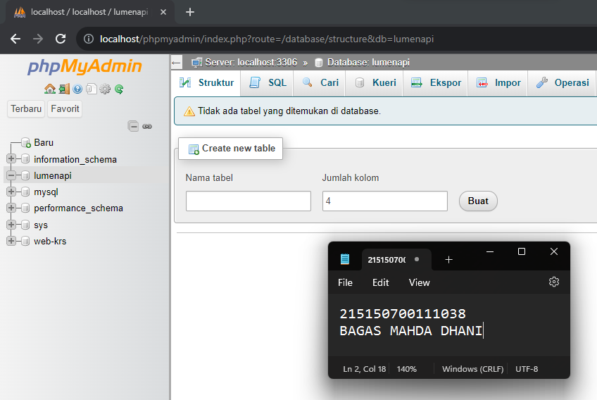

Nama : Bagas Mahda Dhani  
NIM : 215150700111038  
Matkul : Pemin-A

# 📖 Basic Routing dan Migration

## 📒Langkah Percobaan

### GET

1. Menambahkan endpoint dengan method GET pada file web.php folder routes  
   
2. Menjalankan aplikasi dengan command `php -S localhost:8080 -t public`  
   
3. Membuka browser dengan url `http://localhost:8080`  
   

### POST, PUT, PATCH, DELETE, dan OPTIONS

1. Menambahkan methode POST, PUT, PATCH, DELETE, dan OPTIONS pada file web.php folder routes  
   
2. Menginstall extension Thunder client untuk melakukan request ke server  
   
3. Membuat request dengan menekan "New Request" lalu memasukan method dan url yang dituju  
   

### Migrasi Database

1. Membuat database dengan nama 'lumenapi'  
   
2. Mengubah konfigurasi database pada file .env  
   
3. Menghidupkan beberapa library bawaan dari lumen dengan membuka file app.php pada folder boostrapt  
   
4. Membuat file migration untuk tabel user dan tabel product  
   
5. Mengubah fungsi up pada file migration create_user_table  
   
6. Mengubah fungsi up pada file migration  
   
7. Kemudian menjalankan command `php artisan migrate`  
   
