Nama : Bagas Mahda Dhani  
NIM : 215150700111038  
Matkul : Pemin-A

# 📖 Model, Controller dan Request-Response Handler

## 📒 Dasar Teori

### Model

Model merupakan bagian yang bertugas untuk menyiapkan, mengatur, memanipulasi, dan mengorganisasikan data yang ada di database. Model merepresentasikan kolom apa saja yang ada pada databas, termasuk relasi dan primary key dapat didefinisikan di dalam model. Dengan menggunakan perintah Artisan, pembuatan model pada Laravel dapat dilakukan dengan satu perintah menggunakan

`php artisan make:model nama_model`

### Controller

Controller merupakan bagian yang menjadi tempat berkumpulnya logika pemrograman yang digunakan untuk memisahkan organisasi data pada database. Dalam beberapa kasus, controller menjadi penghubung antara model dan view pada arsitektur MVC

### Request Handler

Request handler adalah fungsi yang digunakan untuk berinteraksi dengan request yang datang. Request handler dapat digunakan untuk melihat apa saja yang dikirimkan oleh user seperti parameter, query, dan body.

### Response Handler

Response handler adalah fungsi yang digunakan untuk membentuk output yang diharapkan kepada user dan beberapa properti selain data seperti status code dan header.

## 📒Langkah Percobaan

### Model

1. Pastikan terdapat tabel users yang dibuat menggunakan migration pada bab sebelumnya 
   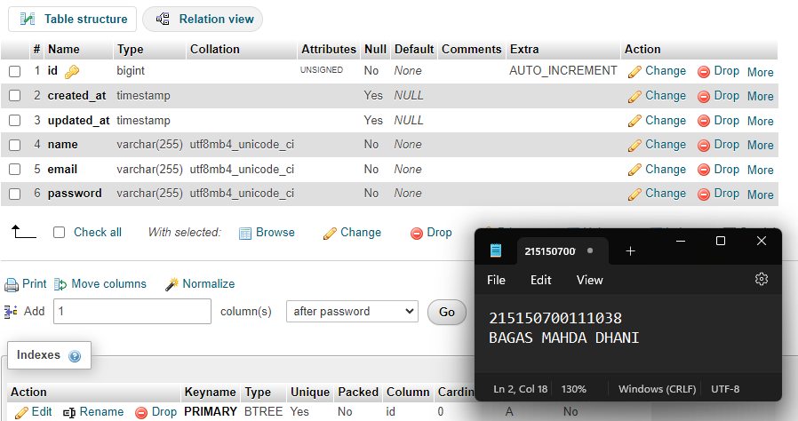
2. Melakukan edit model `User.php` yang ada di dalam path `app/Models/`  
   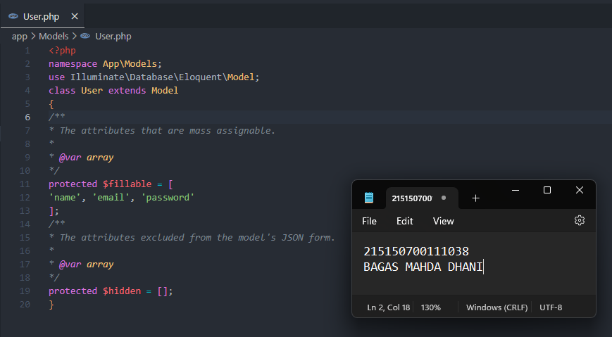

### Controller

1. Salin `ExampleController.php` pada folder `app/Http/Controllers`, ganti namanya menjadi `HomeController.php` dan membuat fungsi `index()`.  
   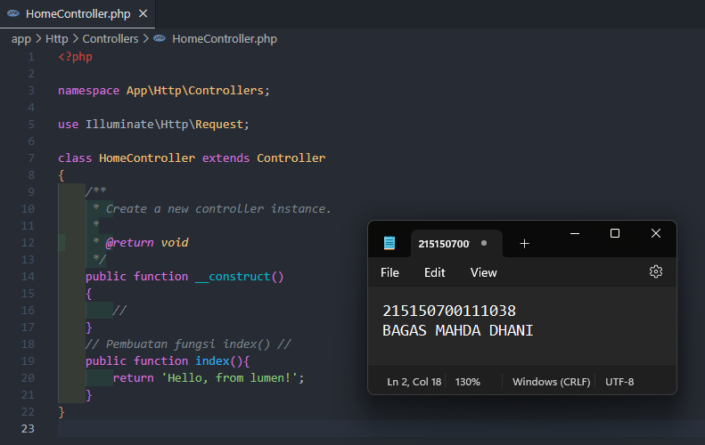
2. Mengubah route `/` pada file `routes/web.php` menjadi seperti gambar dibawah  
   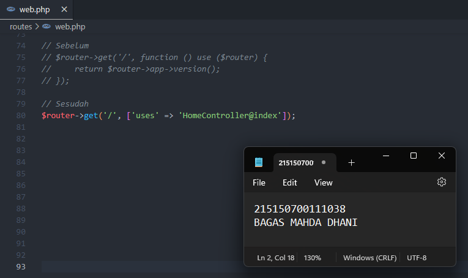
3. Menjalankan aplikasi untuk melihat hasilnya  
   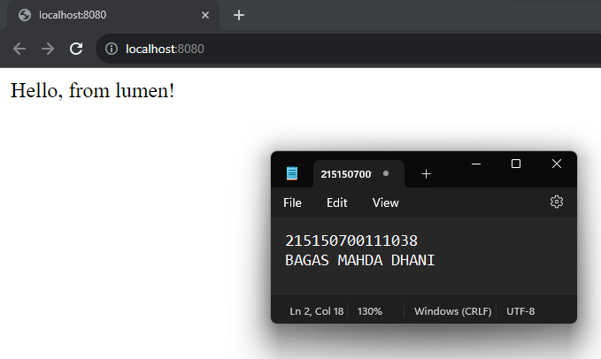

### Request Handler

1. Lakukan import library Request 
   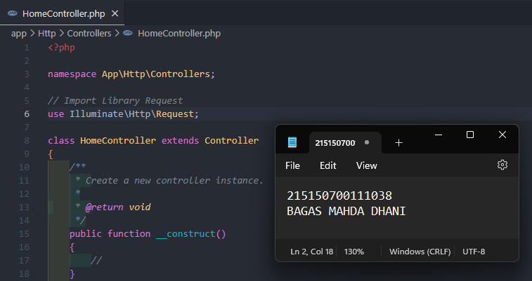
2. Ubah fungsi index menjadi gambar di bawah ini 
   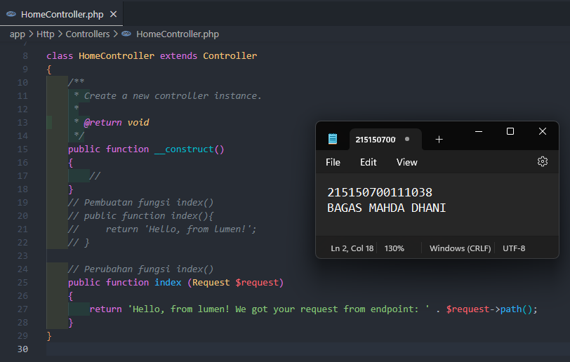
3. Menjalankan aplikasi untuk melihat hasilnya  
   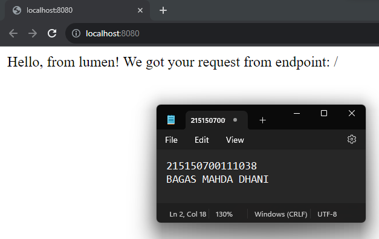

### Response Handler

1. Lakukan import library Response   
   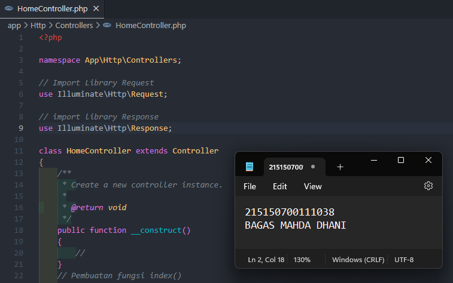
2. Membuat fungsi `hello()` 
   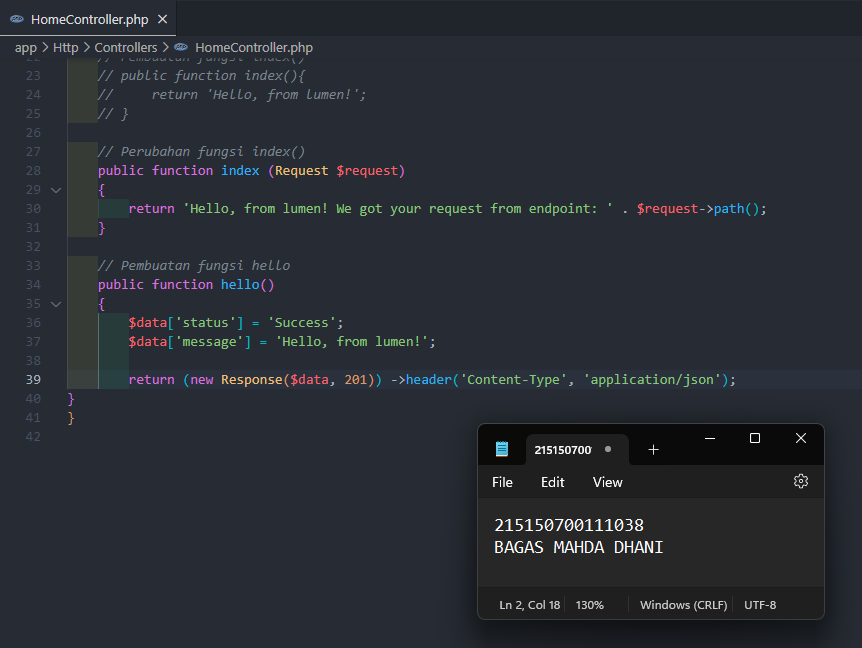
3. Tambahkan route `/hello` pada file `routes/web.php`  
   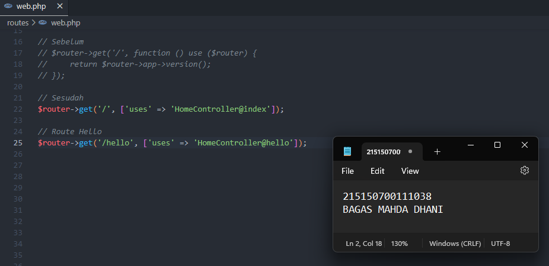
4. Jalankan aplikasi pada route `/hello` untuk melihat hasilnya  
   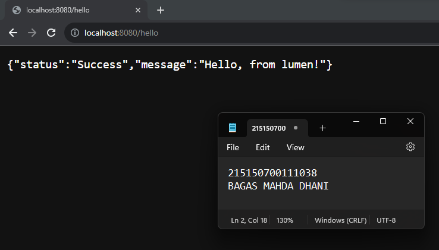

### Penerapan

1. Lakukan import model User  
   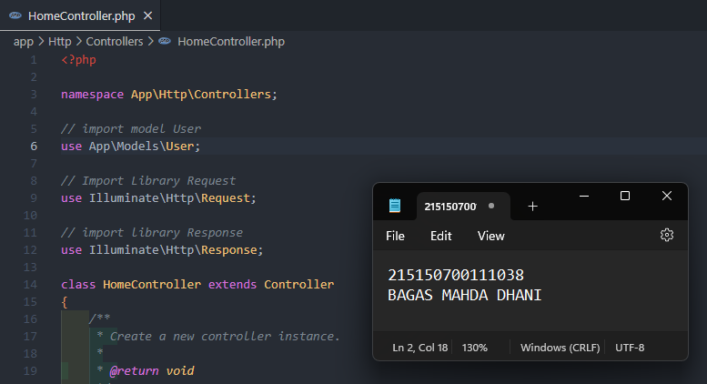
2. Menambahkan 3 fungsi di `HomeController.php`  
   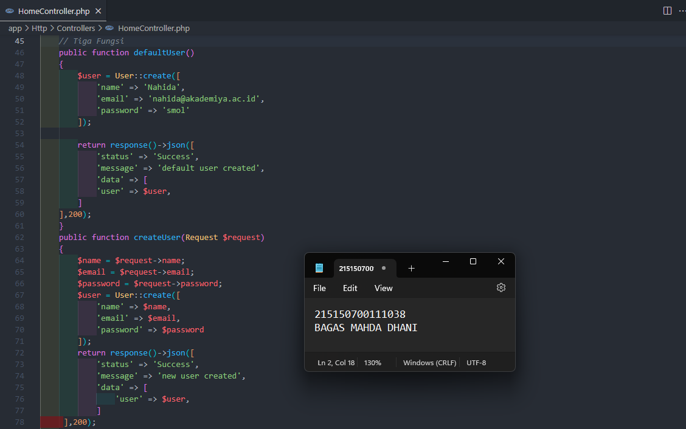
3. Menambahkan ketiga route pada file `routes/web.php` menggunakan group route  
   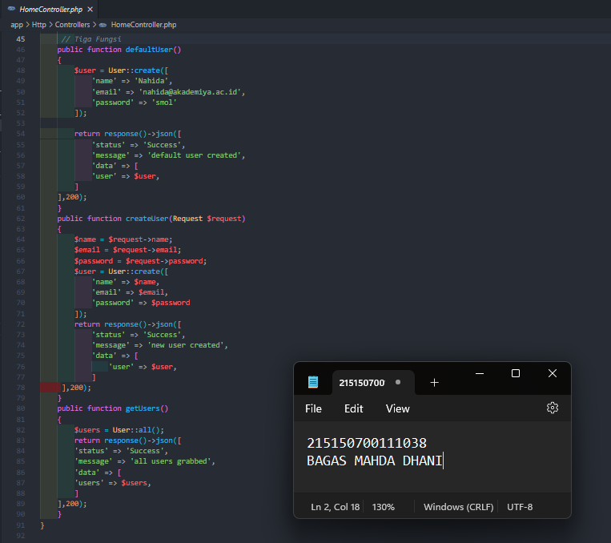
4. Jalankan aplikasi pada route `/users/default` menggunakan Thunderbolt  
   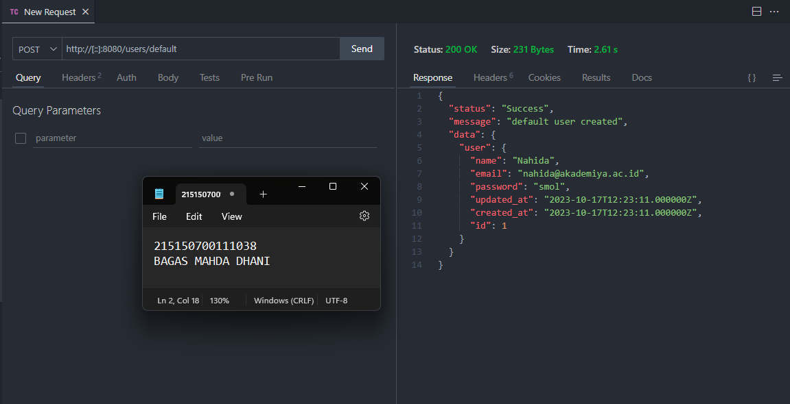
5. Jalankan aplikasi pada route `/users/new` dengan mengisi body  lalu melihat responsenya  
   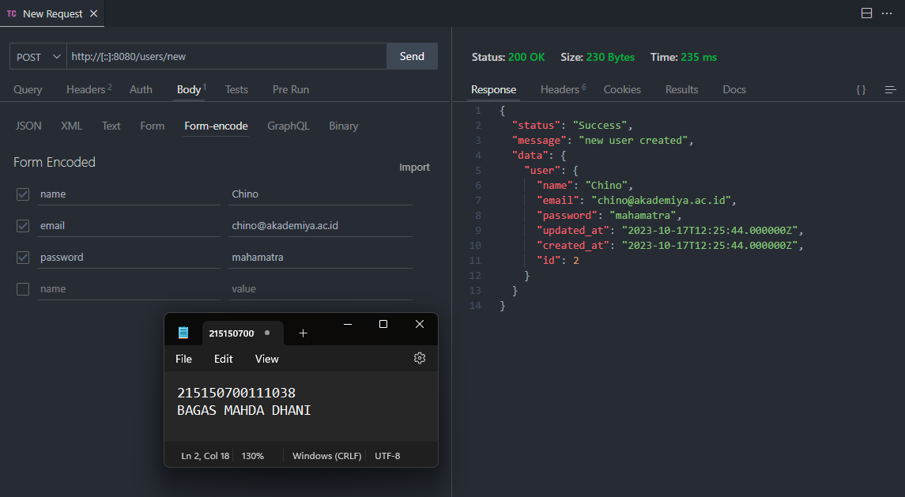
6. Jalankan aplikasi pada route `/users/all`  
   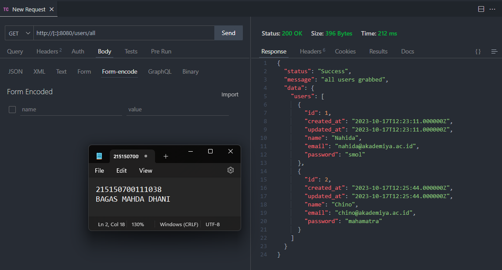
