Nama : Bagas Mahda Dhani  
NIM : 215150700111038  
Matkul : Pemin-A

# 📖 JSON Web Token (JWT)

## 📒 Dasar Teori

### JSON Web Token

JSON Web Token (JWT) adalah standar terbuka yang mendefinisikan cara ringkas dan mandiri untuk transmisi informasi antar pihak secara aman dalam bentuk objek JSON. Informasi ini dapat diverifikasi karena ditandatangani secara digital menggunakan secret key (dengan algoritma HMAC) atau pasangan kunci publik/pribadi menggunakan RSA atau ECSDA

### Penggunaan

    <ul> 
        <li>
            
Authorization

            
Setelah user masuk, setiap request perlu menyertakan. Hal ini mengizinkan user untuk mengakses route, service, dan resource yang diizinkan menggunakan token.

        </li>
        <li>
            
Information Exchange

            
JWT dapat digunakan untuk mengamankan transmisi data antar pihak. Hal ini dimungkinkan karena JWT dapat ditandatangani untuk memastikan data dikirimkan oleh pengirim yang benar. Penggunaan signature yang dihitung dengan header dan payload dapat memverifikasi data yang dikirimkan tidak diubah di tengah jalan.

        </li>
    </ul>

### Struktur

JSON Web Token menggunakan pola berikut. Header, payload, signature dipisahkan dengan titik.

xxxxx.yyyyy.zzzzz

    <ul> 
        <li>
            
Header

            
Berisi algoritma yang digunakan serta jenis token.

            

                {  
                    "alg": "HS256",  
                    "typ": "JWT"  
                }
            

            
Data di atas akan di-encode menjadi Base64

            

                eyJhbGciOiJIUzI1NiIsInR5cCI6IkpXVCJ9
            

        </li>
        <li>
            
Payload

            
Berisi data yang ditransmisikan. Walaupun JWT memastikan dapat yang dikirim tidak diubah, Base64 yang digunakan dapat di-decode. Hal ini membuat JWT tidak dapat digunakan untuk transmisi data rahasia seperti plain text password.

            

                {  
                    "sub": "1234567890",  
                    "name": "Nilou",  
                    "iat": 1516239022  
                }
            

            
Data di atas akan di-encode menjadi Base64

            

                eyJzdWIiOiIxMjM0NTY3ODkwIiwibmFtZSI6Ik5pbG91IiwiaWF0IjoxNTE2MjM5MDIyfQ
            

        </li>
        <li>
            
Signature

            
Hasil penandatanganan yang dilakukan dengan header dan payload yang sudah di-encode diikuti dengan secret key menggunakan algoritma yang didefinisikan di header. Proses penandatanganan menggunakan rumus sebagai berikut

            

                HMACSHA256(  
                    base64UrlEncode(header) + "." +  
                    base64UrlEncode(payload),  
                secret)
            

            
Yang menghasilkan signature sebagai berikut

            

                58_9vUl1BQN7Fpqs7u7r4tyJC_wvFJ5n4GibGTVnGpU
            

        </li>
    </ul>

## 📒Langkah Percobaan

### Penyesuaian database

1. Melakukan perubahan pada length kolom token dengan menghapus parameter 72 di belakangnya 
   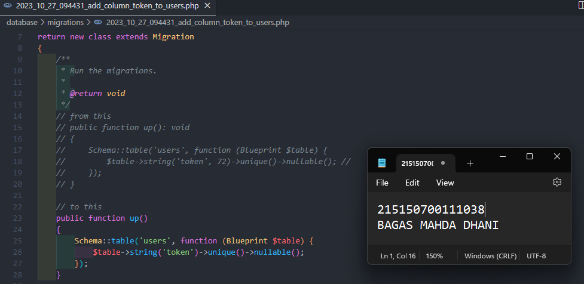
2. Menjalankan perintah `php artisan migrate:fresh` untuk memperbaharui migrasi dan menghapus data yang lama  
   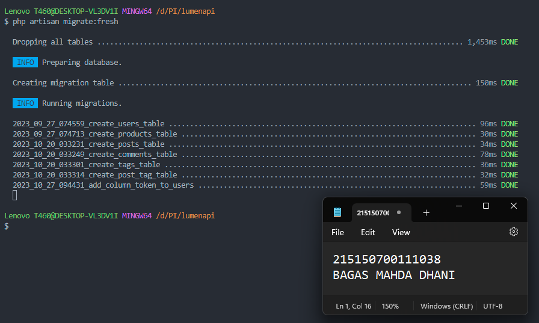
3. Menjalankan aplikasi pada endpoint `/auth/register` dengan body berikut.  
   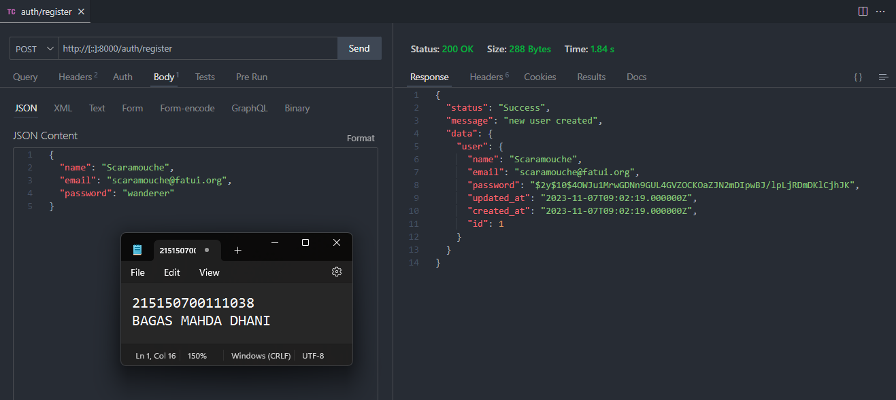

### JWT Manual

1. Menambahkan ketiga fungsi berikut pada `AuthController.php`  
   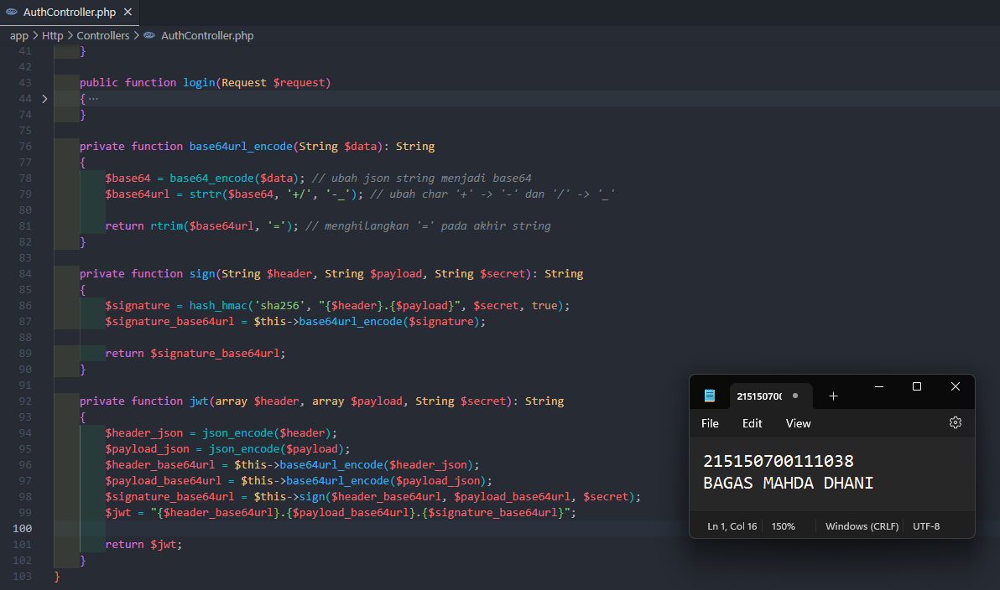
2. Melakukan perubahan pada fungsi `login`  
   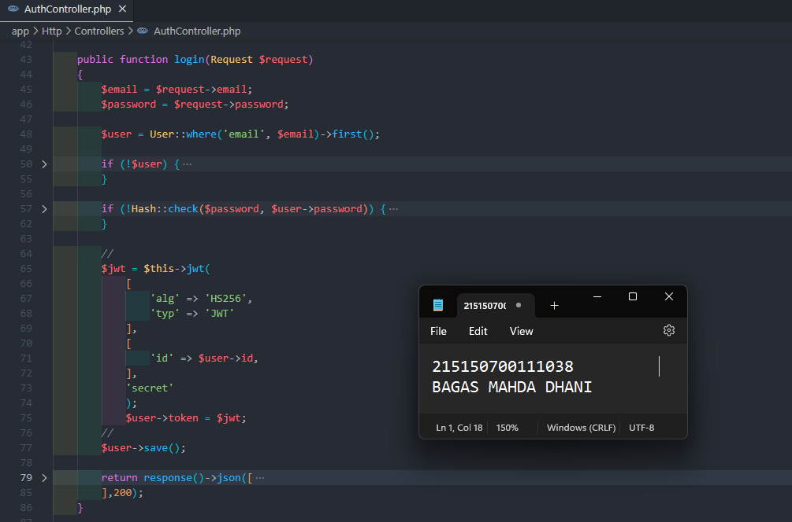
3. Menambahkan keempat fungsi berikut pada `Middleware/Authorization.php`  
   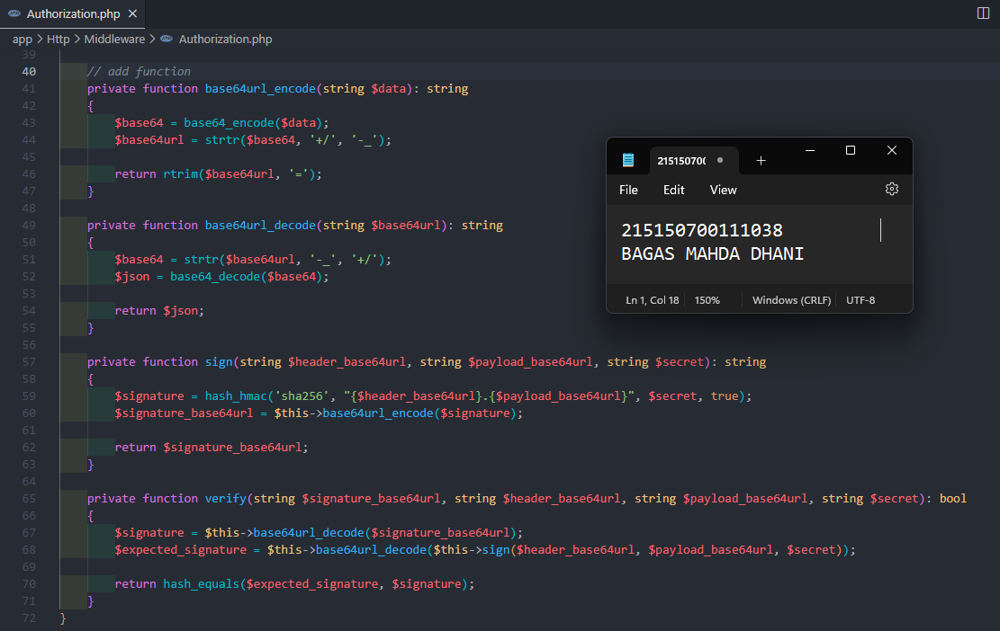
4. Melakukan perubahan pada fungsi `handle`  
   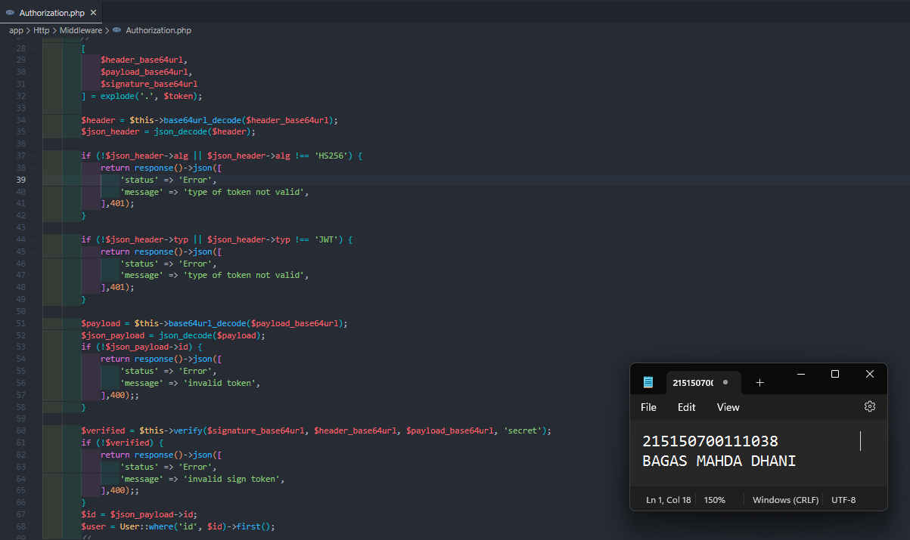
5. Menjalankan aplikasi pada endpoint `/auth/login` dengan body berikut. Salinlah token yang didapat ke notepad  
   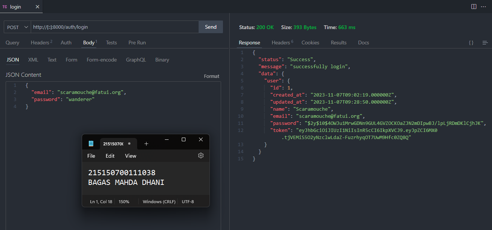
6. Menjalankan aplikasi pada endpoint `/home` dengan melampirkan nilai token yang didapat setelah login pada header  
   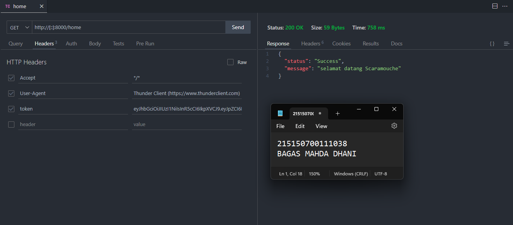

### JWT Library

1. Melakukan generate jwt key secara online menggunakan website Djecrety dan menambahkan pada .env  
   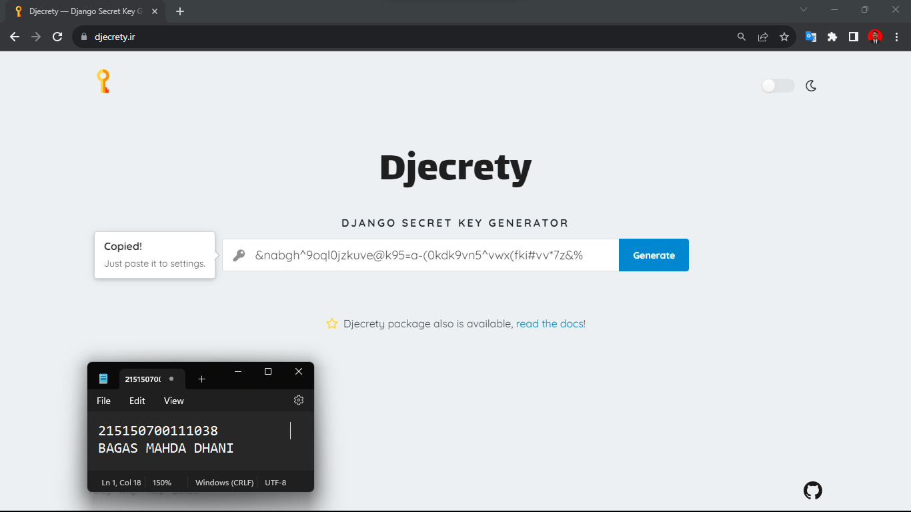
   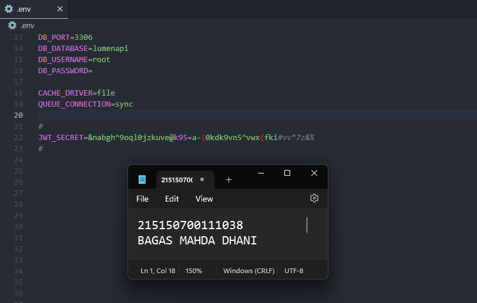
2. Melakukan instalasi package jwt firebase dengan menggunakan command `composer require firebase/php-jwt` 
   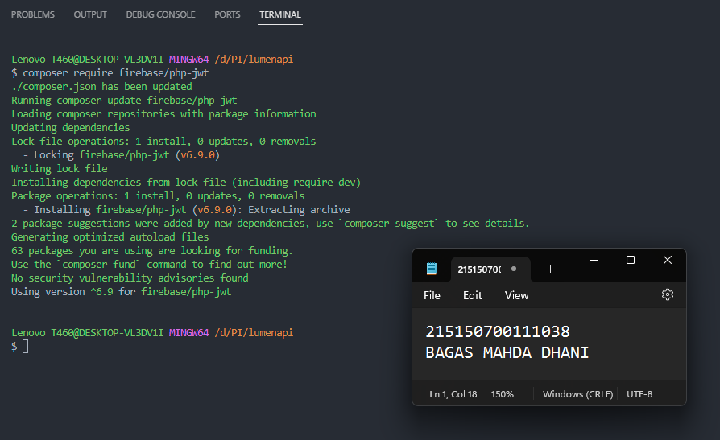
3. Menambahkan fungsi berikut pada file `AuthController` 
   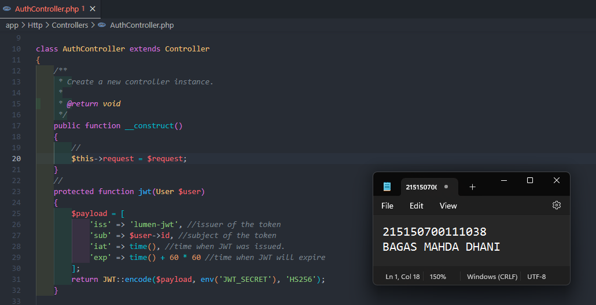
4. Lakukan perubahan pada fungsi `login` menjadi seperti berikut  
   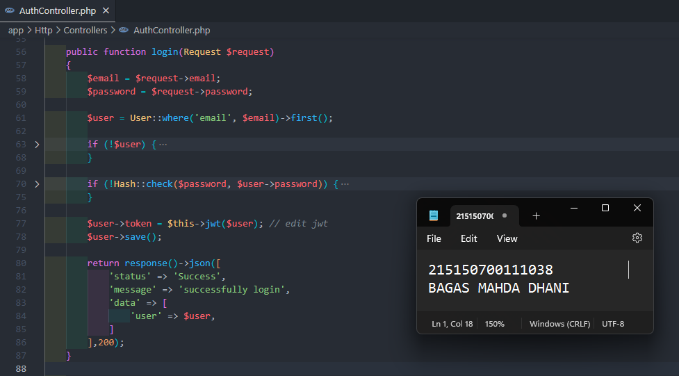
5. Membuat file `JwtMiddleware.php` dan isikan baris code berikut  
   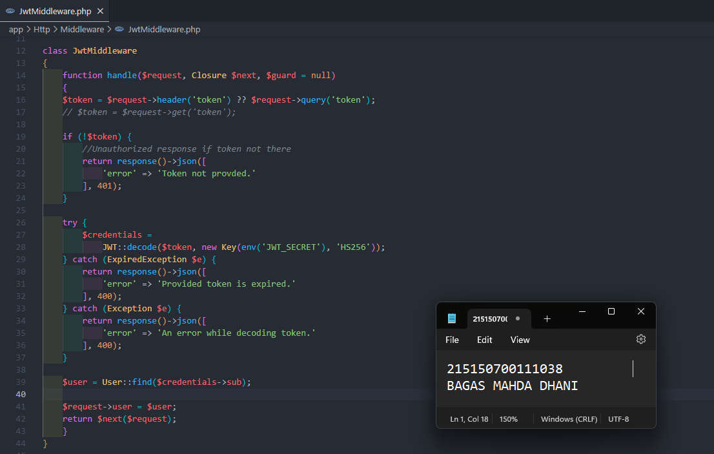
6. Daftarkan middleware yang telah dibuat pada `bootstrap/app.php`  
   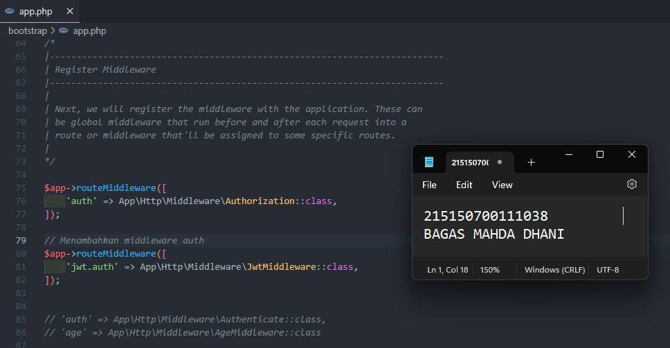
7. Menambahkan baris berikut pada file `web.php`  
   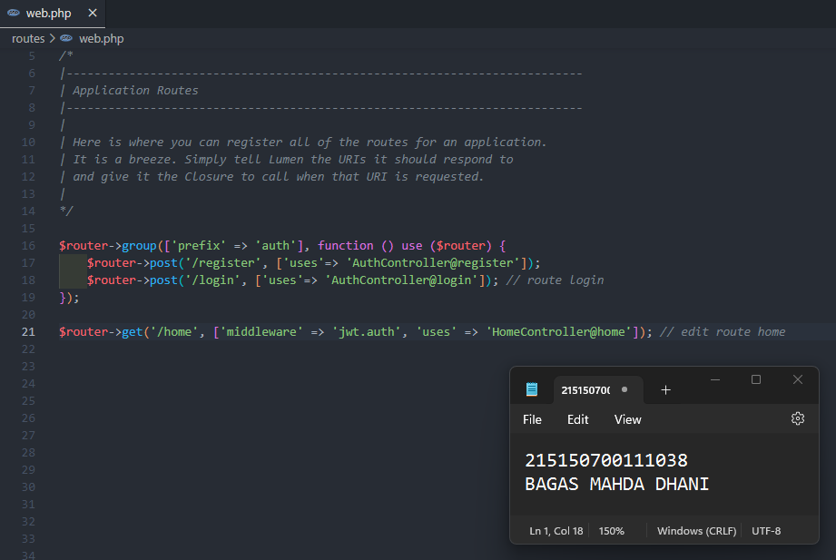
8. Menjalankan aplikasi pada endpoint `/auth/login` dengan body berikut. Salinlah token yang didapat ke notepad yang nanti akan digunakan ketika mengakses .home  
   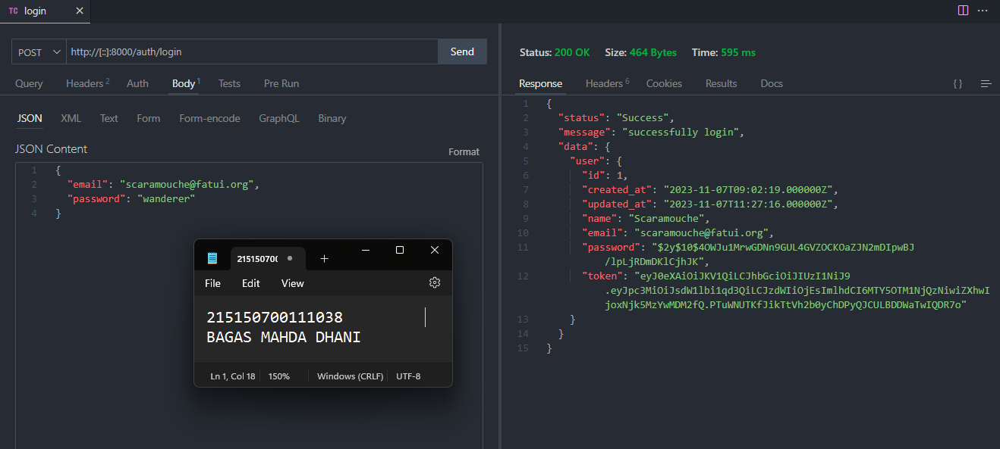
9. Menjalankan aplikasi pada endpoint `/home` dengan melampirkan nilai token yang didapat setelah login pada header  
   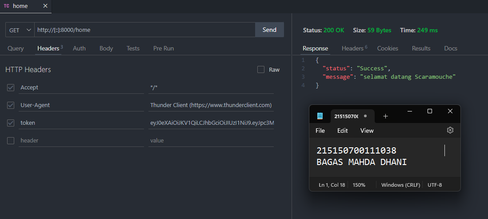
